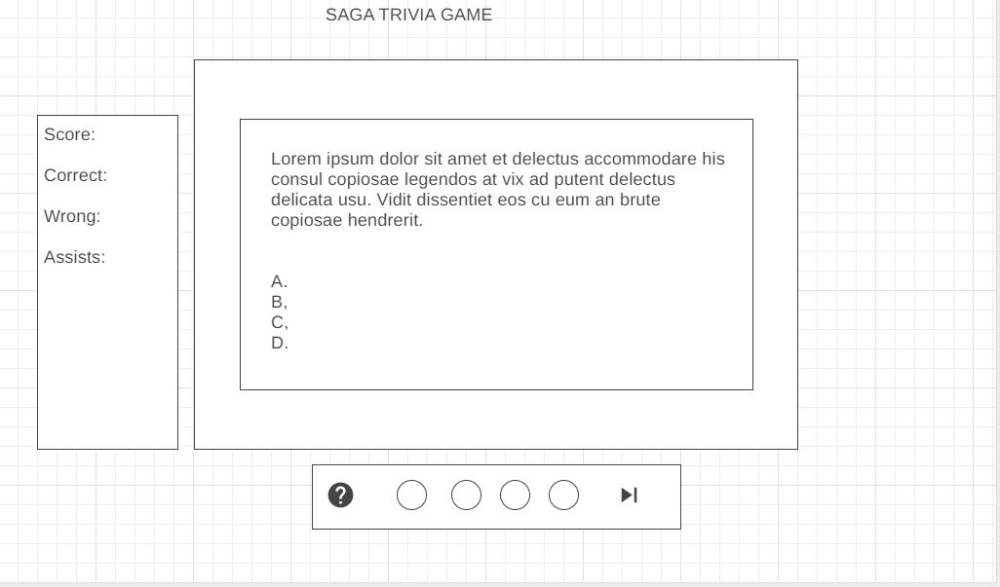

# FantaSci Trivia

## Objective:
Create a browser-based quiz game using HTML, CSS, and JS
#

## PLAY THE GAME
click [here](https://www.fantaSci-trivia.surge.sh) to play

#
## Motivation: 
### As an avid fan of all things scifi/fantasy and barstool trivia, I wanted to create an application that would challenge my knowledge in an entertaining environment. I chose the four movie series I have seen the most to try and challenge others with some of the questions I found to be easy and quite difficult. 
#

## Rules:

* At the start screen you are offered 4 different catagories to choose from. 

* Once you have made your selection, the selected quiz will appear along with you scoreboard. 

* The scoreboard will keep track of how many questions you get right, wrong, and the amount of questions left on the quiz. 

* During play, if you get the answer correct the border of the question box will glow green but red if you are wrong. 
  
* Each category comes with visual references for correct answers and wrong answers. See below for details.

    * Harry Potter :
        * Correct: 
            
            

        * Wrong: 
  
            
    
    * Star Wars :
        * Correct: 
            
            

        * Wrong: 
  
            
    
    * Lord of The Rings :
        * Correct: 
            
            

        * Wrong: 
  
            

    * Marvel :
        * Correct: 
            
            

        * Wrong: 
  
            

* You have 60 seconds to answer 10 questions. Your score will be tallied up at the end and displayed to you when you have completed the quiz.

#

## The Initial Wireframe:

#

## The Final Outlook

#

## Technology implemented:
* JS
* CSS
* HTML
* GIT
* SURGE

## Credits:
### Questions: 
* hp: https://www.scarymommy.com/harry-potter-trivia/

* starW: https://parade.com/1161189/alexandra-hurtado/star-wars-trivia/

* lotr: https://kidadl.com/articles/lord-of-the-rings-trivia-questions-and-answers-are-you-a-true-ringer

* marvel: https://www.hypable.com/marvel-cinematic-universe-trivia-to-test-even-the-smartest-avenger/

### Music:
* hp: https://www.youtube.com/watch?v=PI8h5bDVUX8&t=29s
* starW: https://www.youtube.com/watch?v=bOYdk1UY5o8
* lotr: https://www.youtube.com/watch?v=YR9DMaZWk28
* marvel: https://www.youtube.com/watch?v=FOv9XC3UXIc
* audience: https://www.youtube.com/watch?v=hfq2QNtuA_Q

### Background Images:
* hp: https://i.pinimg.com/originals/28/d9/cf/28d9cf83174278c70f6f658e6049dc37.jpg
* starW: https://cdn.wallpapersafari.com/78/98/5R2EL3.jpg
* lotr: https://images4.alphacoders.com/860/thumb-1920-86098.jpg
* marvel: https://wallpaperaccess.com/full/945603.jpg

### Correct/Wrong Images:

* hp correct: https://icons.iconarchive.com/icons/anton-gerasimenko/harry-potter/128/Remembrall-icon.png
* hp wrong: https://icons.iconarchive.com/icons/anton-gerasimenko/harry-potter/128/Remembrall-2-icon.png

* starW: https://lh3.googleusercontent.com/proxy/yBsRhOsXWGjvTwXyFb7Y5rhZYdi5c5UInpyJFRgjGTwE4_U5h2OPVmPYN3R1ncIAsOBV8KTr5nAgJqDhL_Ak97X0Us2a5hqjfagio8fuGpu0GaL1xzavRUG9e5GZnquPG4rFkMrK-C77L_b-KRiqmcHx91k0jo-DACH02bVMcimKUXpJzfg
  
* lotr correct: https://phantom-elmundo.unidadeditorial.es/1756b0b5c3637cea902b4336ef4bef62/crop/118x0/952x556/f/webp/assets/multimedia/imagenes/2020/06/19/15925787141337.jpg
* lotr wrong: https://memegenerator.net/img/images/300x300/14756717.jpg
  
* marvel correct: https://i.pinimg.com/originals/45/a3/97/45a39716d59ab98a5c0903bf4098ba1a.png
* marvel wrong: https://p.kindpng.com/picc/s/145-1450538_view-media-marvel-hydra-logo-png-transparent-png.png

## Minimum Viable Product:

* As a user, I should be able to select the trivia quiz in the beginning.

* As a user, I should be able to select only one answer per a question.

* As a user, I should be notified of when I was correct and when I was wrong

* As a user, I should be able to change the quiz at any point.

* As a user, I should be able to hear 8 bit theme songs during each different quiz.

* As a user, I should see a message at the end of the game displaying how fast I was and what my score is.

## Stretch Goals:

* Add help button, when clicked a yt video will play from the scene of the displayed question to help players.

* Enhance styling to allow better flow

* Add fetch calls to trivia API's to gather new questions and not rely on stored memory.

* Add score tracking and display highest scores at the start screen.

* Adjust mobile responsiveness.
  